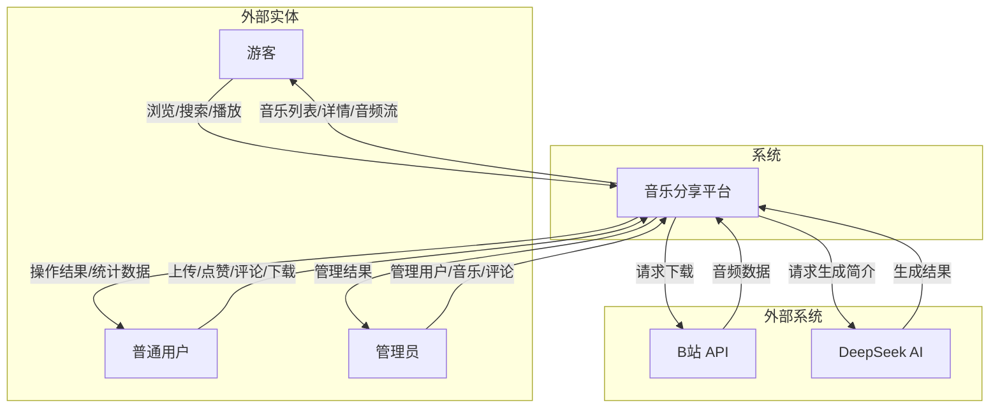
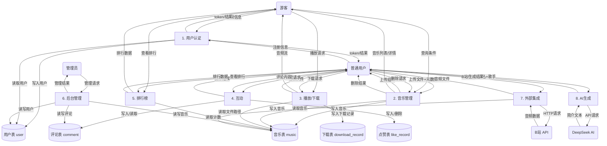

# 数据流图（DFD）

> 项目：音乐分享平台 (MusicDemo)

---

## 一、顶层图（Level 0 — 上下文图）

---

## 二、一层图（Level 1 — 主要功能）

---

## 三、数据字典（DFD 中的数据流说明）

| 编号 | 数据流名 | 来源 | 去向 | 说明 |
|:----:|----------|:----:|:----:|------|
| D1 | 注册信息 | 用户 | 认证模块 | 用户名、密码、昵称、邮箱 |
| D2 | 登录信息 | 游客/用户 | 认证模块 | 用户名、密码 |
| D3 | 上传文件+元数据 | 用户 | 音乐管理 | 音频文件、歌名、歌手、简介 |
| D4 | 查询条件 | 游客/用户 | 音乐管理 | 关键词、页码、每页条数 |
| D5 | 音乐列表/详情 | 音乐管理 | 游客/用户 | 歌曲信息、统计数、评论 |
| D6 | 播放请求 | 游客 | 播放模块 | 音乐ID |
| D7 | 下载请求 | 用户 | 播放模块 | 音乐ID |
| D8 | 音频流/文件 | 播放模块 | 游客/用户 | MP3/FLAC 音频数据 |
| D9 | 点赞请求 | 用户 | 互动模块 | 音乐ID |
| D10 | 评论内容 | 用户 | 互动模块 | 音乐ID + 评论文本 |
| D11 | 管理请求 | 管理员 | 后台管理 | 用户ID、操作类型等 |
| D12 | B站URL | 用户 | 外部集成 | B站视频链接 |
| D13 | 歌名+歌手 | 用户 | AI生成 | 歌曲标题和歌手名 |

---

## 四、处理过程描述

| 编号 | 过程名 | 输入 | 输出 | 逻辑简述 |
|:----:|--------|:----:|:----:|----------|
| P1 | 用户认证 | 用户名+密码 | JWT Token | BCrypt验证，查user表，签发JWT |
| P2 | 音乐管理 | 文件+元数据 | 音乐记录 | 保存文件到磁盘，写入music表，自动抓取封面 |
| P3 | 播放/下载 | 音乐ID | 音频流 | 读取文件路径，支持Range断点续传 |
| P4 | 互动 | 音乐ID+内容 | 评论/点赞记录 | 写入comment/like_record，触发器更新计数 |
| P5 | 排行榜 | 排行类型 | Top10列表 | 按like_count/comment_count/download_count排序 |
| P6 | 后台管理 | 操作指令 | 管理结果 | 增删改用户/音乐/评论 |
| P7 | 外部集成 | B站URL | 音乐文件 | 调用Python子进程下载并导入 |
| P8 | AI生成 | 歌名+歌手 | 简介文本 | 调用DeepSeek API生成简介 |
