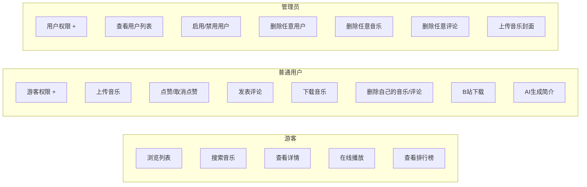
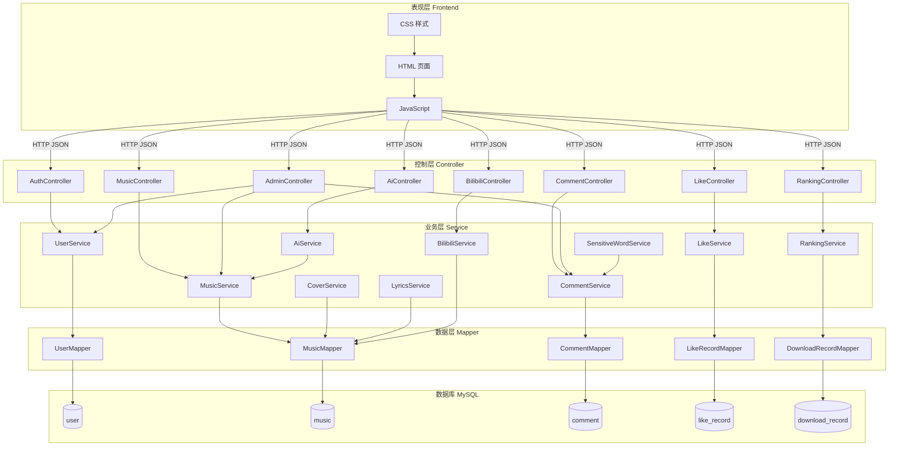

# 系统功能模块图

> 项目：音乐分享平台 (MusicDemo)

---

## 一、总体功能结构

```mermaid
graph TD
    S[音乐分享平台]

    S --> M1[用户模块]
    S --> M2[音乐模块]
    S --> M3[互动模块]
    S --> M4[排行模块]
    S --> M5[管理模块]
    S --> M6[外部集成模块]

    %% 用户模块
    M1 --> M1_1[用户注册]
    M1 --> M1_2[用户登录]
    M1 --> M1_3[Token验证]
    M1 --> M1_4[JWT鉴权]

    %% 音乐模块
    M2 --> M2_1[音乐上传]
    M2 --> M2_2[音乐列表/搜索]
    M2 --> M2_3[音乐详情]
    M2 --> M2_4[在线播放]
    M2 --> M2_5[音乐下载]
    M2 --> M2_6[封面自动抓取]
    M2 --> M2_7[歌词同步显示]

    %% 互动模块
    M3 --> M3_1[点赞/取消点赞]
    M3 --> M3_2[发表评论]
    M3 --> M3_3[删除评论]
    M3 --> M3_4[敏感词过滤]

    %% 排行模块
    M4 --> M4_1[点赞榜 Top10]
    M4 --> M4_2[下载榜 Top10]
    M4 --> M4_3[评论榜 Top10]

    %% 管理模块
    M5 --> M5_1[用户管理]
    M5 --> M5_2[音乐管理]
    M5 --> M5_3[评论管理]
    M5 --> M5_4[封面管理]

    M5_1 --> M5_1_1[用户列表]
    M5_1 --> M5_1_2[启用/禁用用户]
    M5_1 --> M5_1_3[删除用户]

    M5_2 --> M5_2_1[音乐列表]
    M5_2 --> M5_2_2[删除音乐]

    %% 外部集成模块
    M6 --> M6_1[B站音频下载]
    M6 --> M6_2[AI简介生成]
```

---

## 二、用户角色权限矩阵

```mermaid
graph LR
    subgraph 游客
        R1[浏览列表]
        R1A[搜索音乐]
        R1B[查看详情]
        R1C[在线播放]
        R1D[查看排行榜]
    end

    subgraph 普通用户
        R2[游客权限 +]
        R2A[上传音乐]
        R2B[点赞/取消点赞]
        R2C[发表评论]
        R2D[下载音乐]
        R2E[删除自己的音乐/评论]
        R2F[B站下载]
        R2G[AI生成简介]
    end

    subgraph 管理员
        R3[用户权限 +]
        R3A[查看用户列表]
        R3B[启用/禁用用户]
        R3C[删除任意用户]
        R3D[删除任意音乐]
        R3E[删除任意评论]
        R3F[上传音乐封面]
    end
```

---

## 三、系统架构分层

```mermaid
graph TD
    subgraph 表现层 Frontend
        F1[HTML 页面]
        F2[CSS 样式]
        F3[JavaScript]
        F1 --> F3
        F2 --> F1
    end

    subgraph 控制层 Controller
        C1[AuthController]
        C2[MusicController]
        C3[CommentController]
        C4[LikeController]
        C5[RankingController]
        C6[AdminController]
        C7[BilibiliController]
        C8[AiController]
    end

    subgraph 业务层 Service
        S1[UserService]
        S2[MusicService]
        S3[CommentService]
        S4[LikeService]
        S5[RankingService]
        S6[CoverService]
        S7[LyricsService]
        S8[SensitiveWordService]
        S9[BilibiliService]
        S10[AiService]
    end

    subgraph 数据层 Mapper
        M1[UserMapper]
        M2[MusicMapper]
        M3[CommentMapper]
        M4[LikeRecordMapper]
        M5[DownloadRecordMapper]
    end

    subgraph 数据库 MySQL
        D1[(user)]
        D2[(music)]
        D3[(comment)]
        D4[(like_record)]
        D5[(download_record)]

    end

    F3 -->|HTTP JSON| C1
    F3 -->|HTTP JSON| C2
    F3 -->|HTTP JSON| C3
    F3 -->|HTTP JSON| C4
    F3 -->|HTTP JSON| C5
    F3 -->|HTTP JSON| C6
    F3 -->|HTTP JSON| C7
    F3 -->|HTTP JSON| C8

    C1 --> S1
    C2 --> S2
    C3 --> S3
    C4 --> S4
    C5 --> S5
    C6 --> S1 & S2 & S3
    C7 --> S9
    C8 --> S10

    S1 --> M1
    S2 --> M2
    S3 --> M3
    S4 --> M4
    S5 --> M5
    S6 --> M2
    S7 --> M2
    S8 --> S3
    S9 --> M2
    S10 --> S2

    M1 --> D1
    M2 --> D2
    M3 --> D3
    M4 --> D4
    M5 --> D5
```
